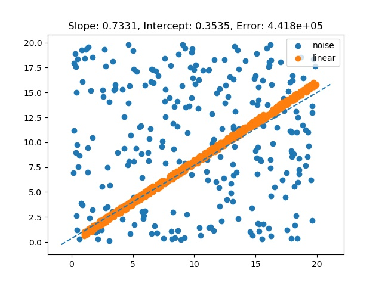

# RANSAC - Report

## Vorbereitung

Mit einem Python Skript werden die Datenpunkte generiert. Dabei können folgende Parameter gesetzt werden:

+ Anzahl der Datenpunkte insgesammt
+ Anteil an Punkten, die komplett zufällig verteilt sind (Ausreißer oder Outlier)
+ Maximale Abweichung von der Geraden
+ Steigung und y-Achsenabschnitt der Geraden

Hinweis: Die Daten werden vor dem Speichern noch einmal gemischt, die Anordnung der Punkte ist also zufällig.

## Kompilieren

Das Programm kann mit oder ohne GPU-Unterstützung kompiliert werden:

``` sh
# mit GPU
nvcc -o gpu -DUSE_GPU=1 src/cuda.cu
# ohne GPU
nvcc -o host -DUSE_GPU=0 src/cuda.cu
```

## Das Programm

Die Kernfunktionalität befindet sich in der `singleIter` Funktion.

Im ersten Schritt werden zwei zufällige Punkte $p$ und $q$ ausgewählt und damit ein Model (in diesem Fall eine Gerade) geschätzt:

$$slope = \frac{q_y - p_y}{q_x - p_x}$$
$$intercept = p_y - slope * p_x$$

Im nächsten Schritt wird berechnet, wie viele Punkte sich in der Nähe der Gerade befinden. Dafür wird die Funktion `countInliers` aufgerufen. Je nachdem, ob USE_GPU auf 1 oder auf 0 gesetzt wurde, wird unterschiedlicher Code verwendet. Im Grunde sieht der Code aber so aus:

1. Mittels `thrust::transform` wird ein Vektor erzeugt, der angibt, ob ein Punkt in der Nähe des Models liegt oder nicht. Dafür wird der eigens definierte `thresh_op` Funktor verwendet. Eine 1 bedeutet, der Wert ist ein Inlier.
2. Mit `thrust::inclusive_scan` wird eine kumulative Summe des Vektors erstellt. Mit dieser Summe kann dann ausgewählt werden, welche Indizes, Inlier sind.

Zu Beginn des Programms wird eine Anzahl an Iterationen festgelegt und für jede Iteration ein Model berechnet. Abschließend wird das Model mit der höchsten Anzahl an Inliers ausgewählt. Die Menge der Inliers wird in eine Datei geschrieben, um auf dieser Menge einen Fit-Algorithmus anzuwenden, der dann die abschließende Gerade berechnet.

## Benutzung

``` sh
# Punkte generieren
python3 util/generate.py 100000
# Inlier finden
./gpu.out
# zur Visualisierung, es wird eine Datei `vis.jpg` erstellt
python3 util/vis.py
```



``` sh
# lineare Regression mit den Inliern
python3 src/fit.py
# es wird eine Datei `fit.jpg` erstellt mit der abschließenden Visualisierung
```


## Zeitmessung

Die Zeit wurde mit einem Python-Skript gemessen:

``` py
generate("points.csv", ...)
t0 = time.time()
os.system("./gpu")
t1 = time.time()
delta = t1 - t0
```

Folgende Zeiten wurden gemessen mit einer Nvidia GeForce GTX 1080ti Grafikkarte und einem Intel(R) Core(TM) i7-8700K CPU @ 3.70GHz Prozessor (sechs Kerne):


Es wird ersichtlich,, das vor allem mit größeren Datenmengen die GPU-Variante deutlich schneller läuft.

Folgender Speedup konnte gemessen werden:


